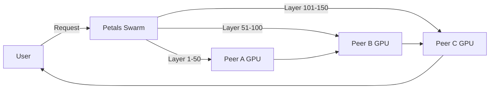
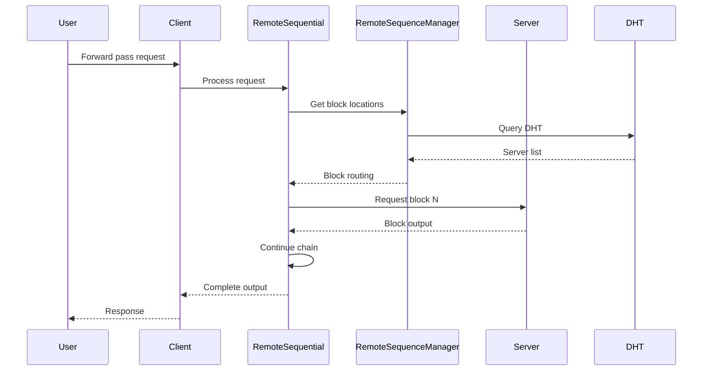
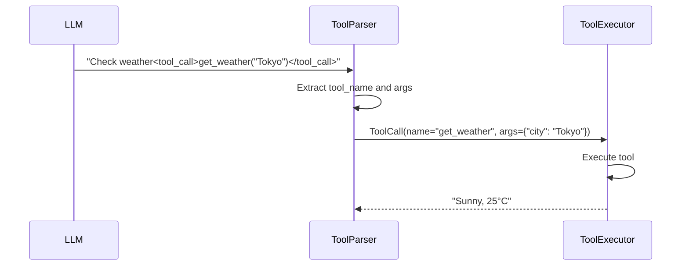

# P2P Petals - New Developer Onboarding Guide

> **Version:** 2.4.0
> **Last Updated:** 2026-03-21
> **For:** New developers joining the project

---

## Table of Contents

1. [What is P2P Petals?](#what-is-p2p-petals)
2. [Quick Start](#quick-start)
3. [Project Structure](#project-structure)
4. [Architecture](#architecture)
5. [HTTP Agent Layer (New)](#http-agent-layer-new)
6. [Development Setup](#development-setup)
7. [Testing](#testing)
8. [Key Concepts](#key-concepts)
9. [Common Tasks](#common-tasks)
10. [Resources](#resources)

---

## What is P2P Petals?

**P2P Petals** is a distributed system for running large language models (LLMs) collaboratively over the Internet, using a BitTorrent-style approach.

### Core Idea

Instead of running a massive model (like Llama 405B) on a single expensive GPU, Petals splits the model across many volunteer computers. Each computer serves a portion of the model layers, and the system routes requests through the swarm.



### Key Capabilities

| Feature | Description |
|---------|-------------|
| **Distributed Inference** | Run 100B+ parameter models without a supercomputer |
| **Collaborative Fine-tuning** | Fine-tune models using PEFT (LoRA, etc.) |
| **HTTP Agent Layer** | LLM-powered agents with tool calling |
| **Multi-Provider Support** | OpenAI, Anthropic, custom endpoints |

### Supported Models

| Model Family | Parameters | Architecture |
|--------------|------------|--------------|
| **Llama** | 7B - 405B | Decoder-only, RoPE |
| **Mixtral** | 8x7B - 8x22B | Mixture of Experts |
| **Falcon** | 7B - 180B | Multi-query attention |
| **BLOOM** | 0.5B - 176B | ALiBi embeddings |

---

## Quick Start

### 1. Install (5 minutes)

```bash
# Clone the repository
git clone https://github.com/bigscience-workshop/petals
cd petals

# Install with uv (recommended)
uv sync --extra dev

# Activate environment
source .venv/bin/activate
```

### 2. Run Your First Model

```python
from transformers import AutoTokenizer
from petals import AutoDistributedModelForCausalLM

# Choose a model from health.petals.dev
model_name = "meta-llama/Meta-Llama-3.1-405B-Instruct"

# Load tokenizer and model
tokenizer = AutoTokenizer.from_pretrained(model_name)
model = AutoDistributedModelForCausalLM.from_pretrained(model_name)

# Run inference
inputs = tokenizer("A cat sat", return_tensors="pt")["input_ids"]
outputs = model.generate(inputs, max_new_tokens=20)
print(tokenizer.decode(outputs[0]))
```

### 3. Host Your Own GPU

```bash
python -m petals.cli.run_server meta-llama/Meta-Llama-3.1-405B-Instruct
```

---

## Project Structure

```
p2p-petals/
├── src/petals/                 # Main source code
│   ├── __init__.py            # Package exports
│   ├── data_structures.py     # Core data types
│   ├── constants.py           # System constants
│   ├── client/                # Client-side modules
│   │   ├── http_client.py     # HTTP LLM client (NEW)
│   │   ├── agent.py           # Agent orchestrator (NEW)
│   │   ├── tool_parser.py     # Tool call parsing (NEW)
│   │   ├── tool_executor.py   # Parallel tool execution (NEW)
│   │   ├── tool_registry.py   # Tool registration (NEW)
│   │   ├── context_manager.py # Context management (NEW)
│   │   └── data_structures.py # Agent data types (NEW)
│   ├── server/                # Server-side modules
│   │   ├── server.py          # Main server class
│   │   ├── transformer_backend.py
│   │   └── ...
│   ├── models/                # Model implementations
│   │   ├── llama/
│   │   ├── mixtral/
│   │   ├── falcon/
│   │   └── bloom/
│   ├── utils/                 # Shared utilities
│   └── cli/                   # CLI entry points
├── tests/                     # Test suite
│   ├── client/               # Client tests (NEW)
│   ├── e2e/                  # E2E tests (NEW)
│   ├── mocks/                # Mock servers (NEW)
│   └── ...
├── docs/                     # Documentation
│   ├── specs/                # Design specifications
│   └── visual-explainers/    # Architecture diagrams
├── pyproject.toml            # Project config
├── README.md                 # Main documentation
├── CLAUDE.md                 # Project guidelines
└── CHANGELOG.md              # Version history
```

---

## Architecture

### System Overview

```mermaid
flowchart TB
    subgraph Client["Client Layer"]
        A[AutoDistributedModelForCausalLM]
        H[HTTPClient]
        O[AgentOrchestrator]
    end

    subgraph Network["Network Layer"]
        RS[RemoteSequential]
        RM[RemoteSequenceManager]
        DHT[DHT Discovery]
    end

    subgraph Server["Server Layer"]
        S[Server]
        TB[TransformerBackend]
        Cache[Memory Cache]
    end

    subgraph Models["Model Layer"]
        L[Llama]
        M[Mixtral]
        F[Falcon]
        B[BLOOM]
    end

    A --> RS --> RM --> DHT
    H --> O --> TB
    RM --> S
    S --> Cache
    TB --> L
    TB --> M
    TB --> F
    TB --> B

    style Client fill:#1a1f29,stroke:#58a6ff
    style Network fill:#1a1f29,stroke:#3fb950
    style Server fill:#1a1f29,stroke:#a371f7
    style Models fill:#1a1f29,stroke:#d29922
```



### Client Layer Flow



### HTTP Agent Layer Flow

The new HTTP Agent Layer enables LLM-powered agents with tool calling:

```mermaid
flowchart LR
    subgraph Input["User Input"]
        Q[Question]
    end

    subgraph Agent["Agent Loop (max 10 iterations)"]
        L1[LLM Generate]
        P[Parse Tools]
        E[Execute Tools]
        U[Update Context]
    end

    subgraph Tools["Available Tools"]
        W[Weather API]
        C[Calculator]
        S[Search]
    end

    Q --> L1
    L1 --> P
    P -->|Has tools| E
    E --> W
    E --> C
    E --> S
    E --> U
    U --> L1
    P -->|No tools| F[Final Response]

    style Agent fill:#2d1f4e,stroke:#a371f7
    style Tools fill:#1f3d2d,stroke:#3fb950
```



---

## HTTP Agent Layer (New)

Added in v2.3.0, this layer provides LLM-powered agents with tool calling support. The Agent Layer implements HTTP-based multi-provider LLM orchestration with DAG-based tool execution, streaming support, and self-correction capabilities.

### Components

| Component | File | Purpose |
|-----------|------|---------|
| **Orchestrator** | `client/orchestrator.py` | Unified orchestrator integrating all phases |
| **DAG** | `client/dag/` | Wave-based tool call execution with dependencies |
| **Async Support** | `client/async_support/` | Task pool, streaming, structured output |
| **Feedback Loop** | `client/feedback/` | CodeAct self-correction with retry policies |
| **Verification** | `client/verification/` | RLM-style result verification |
| **Providers** | `client/providers/` | LLM provider interface (OpenAI, Anthropic) |
| **ToolCallingLLM** | `client/tool_calling_llm.py` | LLM with integrated tool parsing |
| **SSE Server** | `server/routes/tool_execution.py` | FastAPI streaming endpoints |

### Key Design Patterns

| Pattern | Description | Implementation |
|---------|-------------|----------------|
| **ToolCallNode = Async LLM Task** | ToolCall is async task to fill params (NOT execution) | `dag/tool_call_node.py` |
| **Stream on Build** | SSE events emitted as each ToolCall is built | `async_support/streaming_types.py` |
| **DAG over Tree** | AST-based dependencies with shared sub-task deduplication | `dag/dag.py` |
| **Wave Execution** | Parallel execution within waves, sequential between waves | `dag/wave_executor.py` |
| **CodeAct Pattern** | Generate -> Execute -> Capture error -> Format -> LLM corrects | `feedback/feedback_loop.py` |
| **RLM Verification** | Child results verified before parent aggregation | `verification/verifier.py` |

### Supported Protocols

```mermaid
graph LR
    A[HTTPClient] --> B[OpenAI Chat]
    A --> C[OpenAI Responses]
    A --> D[Anthropic Messages]

    B -->|:18001| B1[/v1/chat/completions]
    C -->|:18002| C1[/v1/responses]
    D -->|:18003| D1[/v1/messages]
```

### Quick Example

```python
from petals.client.orchestrator import Orchestrator, OrchestratorConfig
from petals.client.providers import create_provider
from petals.client.tool_registry import ToolRegistry

# Create tool registry
registry = ToolRegistry()

@registry.register_handler("get_weather")
async def get_weather(city: str) -> str:
    return f"Weather in {city}: Sunny, 25C"

# Create LLM provider
provider = create_provider(
    "openai",
    api_key="sk-...",
    model="gpt-4"
)

# Create orchestrator
config = OrchestratorConfig(
    max_concurrency=10,
    enable_verification=True,
    enable_correction=True,
)
orchestrator = Orchestrator(registry, config=config)

# Create tool-calling LLM
from petals.client.tool_calling_llm import ToolCallingLLM
llm = ToolCallingLLM(provider=provider, registry=registry, orchestrator=orchestrator)

# Run with streaming
async for event in llm.run_streaming("What's the weather in Tokyo?"):
    print(f"Event: {event.type.value}")
```

### Tool Call Format

LLMs output tool calls in this XML format:

```
I'll check the weather for you.<tool_call>get_weather({"city": "Tokyo"})</tool_call>
```

---

## Development Setup

### Requirements

| Requirement | Version |
|------------|---------|
| Python | >= 3.9 (3.10-3.12 recommended) |
| CUDA | Optional (for hosting GPU) |
| UV | Recommended package manager |

### Installation Steps

```bash
# 1. Clone repository
git clone https://github.com/bigscience-workshop/petals
cd petals

# 2. Install with uv
uv sync --extra dev

# 3. Activate environment
source .venv/bin/activate

# 4. Verify installation
python -c "import petals; print(petals.__version__)"
```

### Code Style

```bash
# Format code
black src/ tests/

# Sort imports
isort src/ tests/

# Run both
make format
```

| Rule | Value |
|------|-------|
| Line Length | 120 characters |
| Formatter | Black (v22.3.0) |
| Import Sort | isort (profile: black) |

---

## Testing

### Run Tests

```bash
# All tests
pytest tests/

# Specific module
pytest tests/client/ -v

# With coverage
pytest tests/ --cov=src/petals

# Mock servers for protocol testing
python -m tests.mocks.mock_llm_servers --mode all

# Then run protocol tests
python tests/test_quick_protocols.py
```

### Test Structure

```
tests/
├── client/                   # Client module tests
│   ├── test_agent_orchestrator.py
│   ├── test_tool_executor.py
│   ├── test_tool_parser.py
│   └── ...
├── e2e/                      # End-to-end tests
│   └── test_http_client_e2e.py
├── mocks/                    # Mock LLM servers
│   └── mock_llm_servers.py   # Flask servers on ports 18001-18003
├── data_structures/          # Data structure tests
└── ... (other test modules)
```

### Protocol Testing

The mock servers simulate different LLM APIs:

| Port | Protocol | Endpoint |
|------|----------|----------|
| 18001 | OpenAI Chat | `/v1/chat/completions` |
| 18002 | OpenAI Responses | `/v1/responses` |
| 18003 | Anthropic | `/v1/messages` |

```bash
# Start mock servers
python -m tests.mocks.mock_llm_servers --mode all

# Test all protocols
python tests/test_quick_protocols.py
```

---

## Key Concepts

### 1. Distributed Inference

Petals uses **RemoteSequential** to chain transformer blocks across multiple servers:

```python
# Each server serves a portion of layers
remote_sequential = RemoteSequential(
    module=None,  # Will be populated via DHT
    config=config
)

# Forward pass routes through swarm
output = remote_sequential(hidden_states, layer_indices)
```

### 2. DHT Discovery

Uses Hivemind's DHT for peer-to-peer discovery:

```python
from hivemind import DHT

dht = DHT(initial_peers=initial_peers)
peer_id = dht.run()
```

### 3. Tool Calling

LLMs call tools via XML tags, parsed and executed by the agent:



### 4. Memory Management

ContextWindow automatically trims to stay within token budgets:

```python
# Token tracking
context.add_message(role="user", content="Hello")
print(context.total_tokens)  # e.g., 150

# Auto-trim when near limit
context.add_message(...)
# Triggers automatic trimming of oldest messages
```

---

## Common Tasks

### Add a New Tool

```python
from petals.client.tool_registry import ToolRegistry

registry = ToolRegistry()
registry.register(
    name="my_tool",
    description="What my tool does",
    schema={"param1": {"type": "string", "description": "..."}}
)

# Tool function
@registry.register_handler("my_tool")
async def handle_my_tool(param1: str) -> str:
    # Your implementation
    return f"Result: {param1}"
```

### Add a New Model

1. Create directory: `src/petals/models/<model_name>/`
2. Implement:
   - `config.py` - Distributed configuration
   - `block.py` - Transformer block
   - `model.py` - Model class
3. Export in `src/petals/models/__init__.py`

### Run a Custom Endpoint

```python
from petals.client.http_client import HTTPClient

client = HTTPClient(
    api_key="your-key",
    base_url="https://your-endpoint.com/v1",
    default_model="your-model"
)

response = await client.generate("Hello!")
```

---

## Resources

### Documentation

| Resource | Path |
|----------|------|
| Main README | `README.md` |
| Project Guidelines | `CLAUDE.md` |
| Changelog | `CHANGELOG.md` |
| Architecture Diagram | `docs/p2p-petals-architecture.html` |
| Visual Explainer | `docs/visual-explainers/project-recap.html` |
| Diff Review | `docs/visual-explainers/diff-review.html` |

### External Links

| Link | URL |
|------|-----|
| GitHub Repository | https://github.com/bigscience-workshop/petals |
| Swarm Health | https://health.petals.dev |
| Chat Demo | https://chat.petals.dev |
| Research Paper | https://arxiv.org/abs/2209.01188 |
| PyPI Package | https://pypi.org/project/petals/ |
| Discord Community | https://discord.gg/tfHfe8B34k |

### Entry Points

```bash
# Run a model server
python -m petals.cli.run_server <model_name>

# Run DHT bootstrap node
python -m petals.cli.run_dht

# Run tests
pytest tests/

# Start mock LLM servers
python -m tests.mocks.mock_llm_servers --mode all
```

---

## Quick Reference

### Import Everything

```python
from petals import AutoDistributedModelForCausalLM
from petals.client.orchestrator import Orchestrator, OrchestratorConfig
from petals.client.providers import create_provider
from petals.client.tool_registry import ToolRegistry
from petals.client.tool_calling_llm import ToolCallingLLM
```

### Key Classes

| Class | Module | Use Case |
|-------|--------|----------|
| `AutoDistributedModelForCausalLM` | petals | Distributed inference |
| `Orchestrator` | petals.client | DAG-based tool execution |
| `ToolCallingLLM` | petals.client | LLM with integrated tool parsing |
| `ToolRegistry` | petals.client | Tool registration |
| `create_provider` | petals.client.providers | Create LLM providers |

### Environment Variables

| Variable | Purpose |
|----------|---------|
| `PETALS_IGNORE_DEPENDENCY_VERSION` | Skip dependency checks |
| `LLM_API_KEY` | API key for HTTP client tests |
| `LLM_BASE_URL` | Base URL for HTTP client tests |

---

> **Next Steps:**
> 1. Set up your development environment
> 2. Run the quick start example
> 3. Explore `src/petals/client/` for the HTTP Agent Layer
> 4. Run `pytest tests/client/` to see tests pass
> 5. Join the [Discord community](https://discord.gg/tfHfe8B34k) for help
