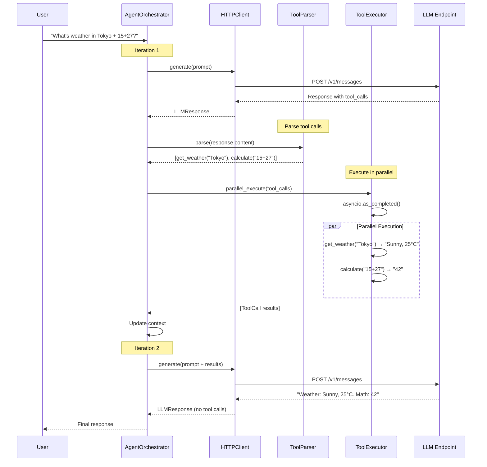
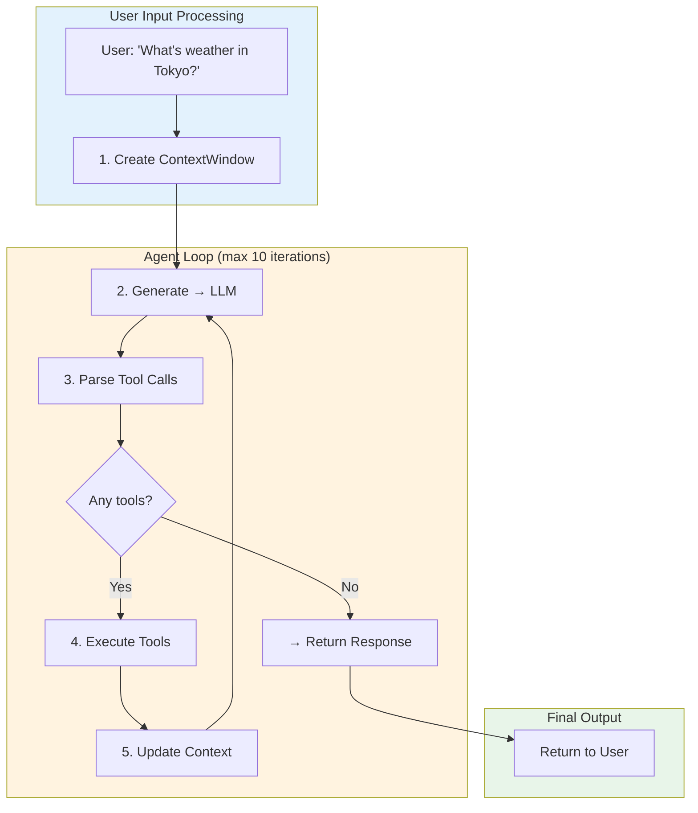

# P2P Petals - Agent HTTP Layer Project Recap

> **Generated:** 2026-03-20
> **Scope:** HTTP-based LLM integration with tool calling support

---

## What Changed

### Architecture Shift

We added an HTTP-based agent layer that allows calling LLMs through an Anthropic-compatible API endpoint (`http://127.0.0.1:3456/v1`).

```
┌─────────────────────────────────────────────────────────────────┐
│                        User Application                          │
└─────────────────────────────────────────────────────────────────┘
                                │
                                ▼
┌─────────────────────────────────────────────────────────────────┐
│                     AgentOrchestrator                            │
│  ┌──────────────┐  ┌────────────┐  ┌────────────┐  ┌────────┐  │
│  │HTTPClient    │  │ToolParser  │  │ToolExecutor│  │Context │  │
│  │(litellm)     │  │            │  │            │  │Manager │  │
│  └──────────────┘  └────────────┘  └────────────┘  └────────┘  │
└─────────────────────────────────────────────────────────────────┘
                                │
                                ▼
┌─────────────────────────────────────────────────────────────────┐
│              HTTP Endpoint (OpenAI/Anthropic compatible)         │
│                    http://127.0.0.1:3456/v1                     │
└─────────────────────────────────────────────────────────────────┘
```

### Key Files Modified

| File | Purpose |
|------|---------|
| `src/petals/client/http_client.py` | HTTP client using litellm for unified LLM interface |
| `src/petals/client/agent.py` | Agent orchestrator with full loop control |
| `src/petals/client/tool_parser.py` | Parses `<tool_call>...</tool_call>` from LLM output |
| `src/petals/client/tool_executor.py` | Executes tools with async parallel support |
| `tests/e2e/test_http_client_e2e.py` | E2E tests with real endpoints |

---

## How Tool Calls Work

### The Flow



### User Input → Tool Call Iteration



### Tool Parsing Syntax

LLMs output tool calls in this format:

```
I'll check the weather for you.<tool_call>get_weather({"city": "Tokyo"})</tool_call>
```

The `ToolParser` extracts these using regex:
- **Pattern:** `<tool_call>(.*?)</tool_call>`
- **Format:** `tool_name({...json args...})`

---

## Key Design Decisions

### 1. litellm for Provider Abstraction

```python
# Unified interface for OpenAI, Anthropic, custom endpoints
from petals.client.http_client import HTTPClient

client = HTTPClient(
    api_key="key",
    base_url="http://127.0.0.1:3456/v1",
    default_model="claude-4.5-sonnet",
)
```

**Why litellm?**
- Handles auth headers, timeouts, retries automatically
- Provider prefix system (`openai/`, `anthropic/`)
- Single interface for multiple LLM providers

### 2. Generator Pattern for Memory Efficiency

```python
async for result in self.executor.parallel_execute(tool_calls):
    results.append(result)
```

Uses `asyncio.as_completed()` to yield results as they finish, reducing memory for large tool sets.

### 3. Context Management

- `ContextWindow` tracks conversation history
- Auto-trimming when approaching token limits
- System prompt injection support

### 4. Anthropic `/messages` API Support

Fixed URL normalization for Anthropic-compatible endpoints:
```python
# litellm adds /v1/messages, so strip it from base_url
api_base = self.base_url.rstrip("/")
if api_base.endswith("/v1"):
    api_base = api_base[:-3]
```

---

## Test Results

All tests passing:

| Test | Status | Duration |
|------|--------|----------|
| `test_simple_generate` | ✅ | 4.3s |
| `test_chat_completion` | ✅ | - |
| `test_agent_simple_task` | ✅ | - |
| `test_agent_with_tools` | ✅ | 11.9s |
| Unit tests (77) | ✅ | - |

---

## Files Reference

### Core Components

```
src/petals/client/
├── http_client.py      # litellm wrapper, handles OpenAI/Anthropic
├── agent.py            # AgentOrchestrator, main loop
├── tool_parser.py      # <tool_call> extraction
├── tool_executor.py    # Async parallel execution
├── tool_registry.py    # Tool registration
├── context_manager.py  # ContextWindow management
└── data_structures.py  # Message, ContextWindow classes
```

### Test Files

```
tests/e2e/
└── test_http_client_e2e.py  # 6 E2E tests
```

### Reports

```
docs/e2e-reports/
├── test_simple_generate_*.json
├── test_agent_with_tools_*.json
└── summary_*.json
```
